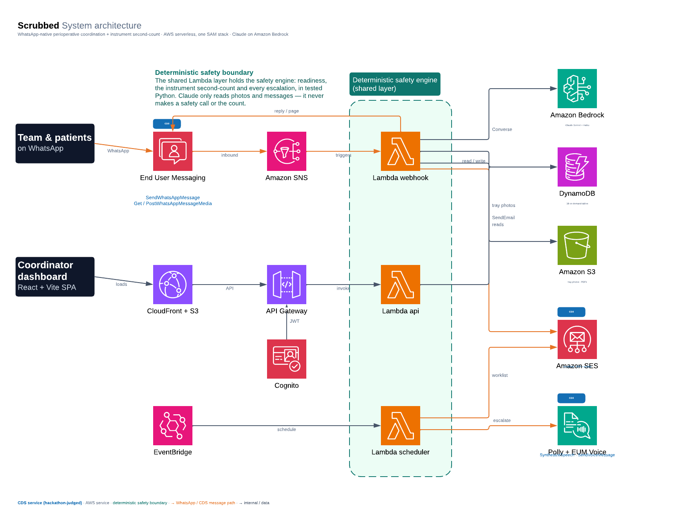

# Scrubbed

Keep a surgical case on track from WhatsApp, before and after the operation, and do the one
check a team cannot get wrong: a second count of the instrument tray. The clinical team runs
it from WhatsApp; the coordinator watches it from a dashboard. A deterministic, tested safety
engine owns every rule, count and escalation. Claude only reads photos and messages and
routes them; it never makes a safety call. Built for the AWS CDS Agentic AI Hackathon on AWS
serverless, one SAM stack, Claude on Amazon Bedrock.

| | |
|---|---|
| Dashboard | https://d3m2lk7yv7pxks.cloudfront.net |
| API | https://yu3kfw3x0a.execute-api.us-east-1.amazonaws.com |

## What it does

- Email one-time-code login, a menu, and natural language in WhatsApp ("page the team for the 2pm", "start the checklist for the gallbladder case").
- WHO Surgical Safety Checklist (sign-in / time-out / sign-out), ticked in chat.
- Paging ladder: fan a page to the roster, track sent → delivered → read → acknowledged, and auto-escalate to a voice note (and a call) when a page goes unacknowledged.
- Instrument second-count: before/after tray photos → Claude vision catalogues each → a deterministic diff flags anything unaccounted for and escalates to the surgeon with an audit PDF. The manual WHO count stays the authority.
- Patient readiness, a cancellation-risk score, a worklist emailed to coordinators, and a post-op check-in that escalates danger signs to a clinician (it never diagnoses or reassures).

## Architecture



Three Python 3.12 Lambdas share one layer: `scrubbed-webhook` (WhatsApp inbound via SNS —
the patient flow and the staff app), `scrubbed-api` (the dashboard HTTP API behind API
Gateway + Cognito, scoped to the caller's hospital), and `scrubbed-scheduler` (EventBridge,
every 5 minutes: escalate overdue pages, sweep at-risk cases and email the worklist, send due
follow-ups). The shared layer holds the **deterministic safety engine** — readiness scoring,
cancellation risk, the instrument diff, the WHO checklist and the escalation threshold, in
tested Python. Claude reads a tray photo or a patient message and returns structured data;
the engine decides what it means, and every case id Claude names is re-validated against the
caller's hospital. Ten DynamoDB tables; the dashboard is a React + Vite build on S3 +
CloudFront.

**CDS services at runtime** (made by the deployed Lambdas; all in `services/layer/python/common/cds.py` and `agent/llm.py`):

| Service | Call |
|---|---|
| End User Messaging Social | `SendWhatsAppMessage`, `GetWhatsAppMessageMedia`, `PostWhatsAppMessageMedia` |
| Amazon SES v2 | `SendEmail` (login codes, the at-risk worklist PDF) |
| End User Messaging Voice | `SendVoiceMessage` (the unacknowledged-page escalation) |
| Amazon Polly | `SynthesizeSpeech` (the spoken page for the WhatsApp voice note) |
| Amazon Bedrock | `Converse` — Claude Sonnet (tray vision), Claude Haiku (classify/route) |

## Run it

```bash
cd infra && ./deploy.sh                                   # build + deploy (sends stay dry)
./deploy.sh SendMode=live SesSender=billing@brownshift.com  # turn real sends on
cd .. && .venv/bin/python infra/seed.py                   # seed a demo hospital, team, cases
cd web && npm install && npm run build
aws s3 sync dist/ s3://<WebBucket>/ --delete
aws cloudfront create-invalidation --distribution-id <WebDistributionId> --paths '/*'
```

## Tests

```bash
.venv/bin/python -m pytest services/tests -q    # 186 tests: pytest + moto (DynamoDB), a fake Bedrock
```

## Repository layout

```
infra/       SAM template, deploy script, seed
services/    functions (webhook, api, scheduler), layer (safety, agent, common, wa), tests
web/         React + Vite coordinator dashboard
submission/  architecture diagram
```

## Licence

MIT. See [LICENSE](LICENSE).
